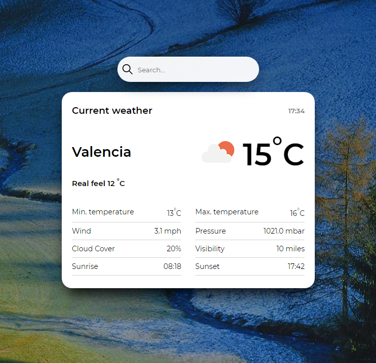

# :tada: Weather App

PWA Weather React application

  

## :pencil: Description

Weather app is progressive web application where we can check the weather around the world.  
 
A progressive web application (PWA) is a type of application software delivered through the web, built using common web technologies including HTML, CSS and JavaScript. It is intended to work on any platform that uses a standards-compliant browser. Functionality includes working offline, push notifications, and device hardware access, enabling creating user experiences similar to native applications on desktop and mobile devices.  
 
The application uses an external API [OpenWeather](https://openweathermap.org/api), which provides access current weather data for any location including over 200,000 cities.  
 

  

## :construction_worker: Install

### `npm install`

Installs the necessary application dependencies

## Available Scripts

In the project directory, you can run:

### `npm start`

Runs the app in the development mode. 
Open [http://localhost:3000](http://localhost:3000) to view it in the browser.

### `npm run test`

Launches the test runner in the interactive watch mode.

## :movie_camera: Live

https://eszczepan-weatherapp.netlify.app/
